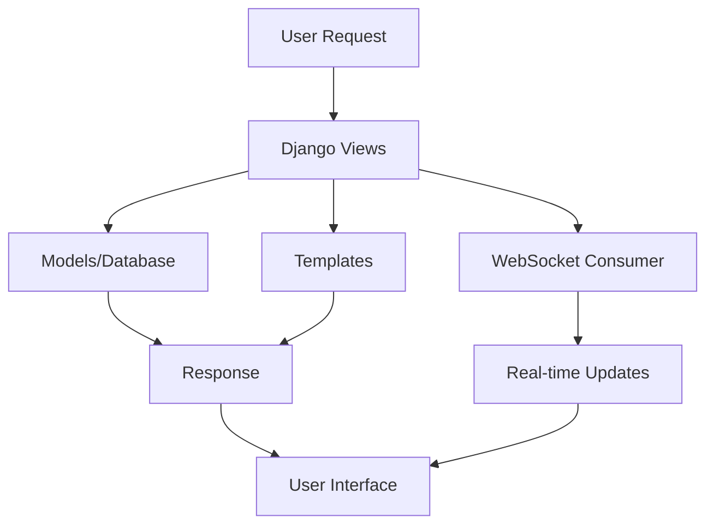

# 🚀 QuickPost - Modern Social Media Platform

<div align="center">


[](https://djangoproject.com/)
[](https://python.org/)
[](https://channels.readthedocs.io/)
[](#)

**A modern, feature-rich social media platform built with Django, featuring real-time messaging, dark theme UI, and comprehensive social features.**


</div>

---

## 📖 Table of Contents

- [✨ Features](#features)
- [🎯 Use Cases](#use-cases)
- [🚀 Quick Start](#quick-start)
- [⚙️ Installation](#installation)
- [🎮 Usage](#usage)
- [🏗️ Architecture](#architecture)
- [🎨 UI/UX Features](#uiux-features)
- [🔧 API Endpoints](#api-endpoints)
- [📱 Mobile Support](#mobile-support)
- [🛠️ Tech Stack](#tech-stack)
- [🔒 Security Features](#security-features)
- [📊 Performance](#performance)
- [🤝 Contributing](#contributing)
- [📝 License](#license)

---

## ✨ Features

### 🎭 **Core Social Features**
- **📝 Post Creation & Management** - Create, edit, delete posts with rich media support
- **🖼️ Media Sharing** - Upload and share images with automatic optimization
- **👍 Engagement System** - Like/dislike posts with real-time counters
- **💬 Comment System** - Threaded comments with real-time updates
- **👥 User Profiles** - Customizable profiles with bio, avatar, and social links
- **🔔 Follow System** - Follow/unfollow users, view followers/following lists

### 💻 **Real-time Messaging**
- **⚡ Live Chat** - Real-time messaging with WebSocket support
- **📧 Inbox Management** - Modern inbox-style conversation list
- **👀 Typing Indicators** - See when someone is typing
- **✅ Message Status** - Read receipts and delivery confirmations
- **📱 Responsive Design** - Optimized for all device sizes

### 🎨 **Modern UI/UX**
- **🌙 Dark Theme** - Beautiful dark mode with modern gradients
- **🎯 Responsive Design** - Mobile-first approach with seamless experience
- **✨ Smooth Animations** - Micro-interactions and smooth transitions
- **🖱️ Interactive Elements** - Hover effects and visual feedback
- **🎨 Glassmorphism Effects** - Modern frosted glass design elements

### 🔐 **Authentication & Security**
- **🔒 User Authentication** - Secure login/register system
- **👤 Profile Management** - Edit profile information and avatar
- **🛡️ CSRF Protection** - Built-in security measures
- **🔐 Session Management** - Secure user sessions

---

## 🎯 Use Cases

### 👥 **Social Networking**
- **Personal Blogging** - Share thoughts, experiences, and updates
- **Photo Sharing** - Create visual stories with image uploads
- **Community Building** - Follow friends and build social circles
- **Content Discovery** - Explore posts from followed users

### 💼 **Business Applications**
- **Team Communication** - Internal messaging and updates
- **Project Updates** - Share progress and announcements
- **Company News** - Broadcast important information
- **Employee Engagement** - Foster team interaction

### 🎓 **Educational Platforms**
- **Student Communities** - Connect students and share resources
- **Announcement Boards** - Share academic updates and news
- **Study Groups** - Collaborate and communicate with peers
- **Teacher-Student Interaction** - Direct messaging and Q&A

### 🏢 **Organizations**
- **Event Updates** - Share upcoming events and activities
- **Member Communication** - Keep members engaged and informed
- **Resource Sharing** - Share documents and important links
- **Community Feedback** - Collect and respond to member input

---

## 🚀 Quick Start

### Prerequisites
- Python 3.12+
- pip (Python package manager)
- Redis server (for WebSocket support)
- Git

### 1️⃣ Clone the Repository
```bash
git clone https://github.com/RajeebLochan/QuickPost.git
cd QuickPost
```

### 2️⃣ Set Up Virtual Environment
```bash
# Create virtual environment
python -m venv venv

# Activate virtual environment
# On Windows:
venv\Scripts\activate
# On macOS/Linux:
source venv/bin/activate
```

### 3️⃣ Install Dependencies
```bash
pip install -r requirements.txt
```

### 4️⃣ Configure Database
```bash
cd quickpost
python manage.py makemigrations
python manage.py migrate
```

### 5️⃣ Create Superuser (Optional)
```bash
python manage.py createsuperuser
```

### 6️⃣ Run the Application
```bash
python manage.py runserver
```

### 7️⃣ Access the Application
Open your browser and navigate to: `http://localhost:8000`

---

## ⚙️ Installation

### Development Setup

1. **Clone and Enter Directory**
   ```bash
   git clone https://github.com/RajeebLochan/QuickPost.git
   cd QuickPost
   ```

2. **Environment Setup**
   ```bash
   python -m venv venv
   source venv/bin/activate  # Linux/macOS
   # or
   venv\Scripts\activate     # Windows
   ```

3. **Install Dependencies**
   ```bash
   pip install -r requirements.txt
   ```

4. **Environment Variables (Optional)**
   Create a `.env` file in the root directory:
   ```env
   DEBUG=True
   SECRET_KEY=your-secret-key-here
   GOOGLE_API_KEY=your-google-api-key  # For quote generation
   ```

5. **Database Migration**
   ```bash
   cd quickpost
   python manage.py makemigrations
   python manage.py migrate
   ```

6. **Static Files Collection**
   ```bash
   python manage.py collectstatic --noinput
   ```

### Production Setup

1. **Set Environment Variables**
   ```env
   DEBUG=False
   ALLOWED_HOSTS=yourdomain.com,www.yourdomain.com
   SECRET_KEY=your-production-secret-key
   ```

2. **Configure Database** (PostgreSQL recommended)
   ```python
   # In settings.py
   DATABASES = {
       'default': {
           'ENGINE': 'django.db.backends.postgresql',
           'NAME': 'quickpost_db',
           'USER': 'your_db_user',
           'PASSWORD': 'your_db_password',
           'HOST': 'localhost',
           'PORT': '5432',
       }
   }
   ```

3. **Set Up Redis** (for WebSocket support)
   ```bash
   # Install Redis
   sudo apt-get install redis-server  # Ubuntu/Debian
   brew install redis                 # macOS
   ```

4. **Configure Web Server** (Nginx + Gunicorn recommended)

---

## 🎮 Usage

### 👤 User Management

**Registration**
```python
# Navigate to /accounts/register/
# Fill in the registration form
# Automatic login after successful registration
```

**Profile Management**
```python
# Navigate to /post/profile/edit/
# Update bio, profile image, location, website
# View profile stats and social connections
```

### 📝 Creating Posts

**Text Posts**
```python
# Navigate to /post/create/
# Enter content (max 240 characters)
# Click "Share Post" to publish
```

**Image Posts**
```python
# Navigate to /post/create/
# Add content and select image file
# Automatic image optimization
# Click "Share Post" to publish
```

### 💬 Messaging

**Start Conversation**
```python
# Visit user profile
# Click "Message" button
# Start typing in the chat interface
```

**Real-time Features**
```python
# Typing indicators appear when user types
# Messages appear instantly via WebSocket
# Fallback to AJAX if WebSocket unavailable
```

### 🔍 Social Features

**Following Users**
```python
# Visit user profile
# Click "Follow" button
# View posts in main feed
# Access followers/following lists
```

**Engagement**
```python
# Like/dislike posts with instant feedback
# Add comments with real-time updates
# View engagement statistics
```

---

## 🏗️ Architecture

### 📁 Project Structure
```
QuickPost/
├── quickpost/                 # Main Django project
│   ├── quickpost/            # Project settings
│   │   ├── settings.py       # Configuration
│   │   ├── urls.py          # URL routing
│   │   ├── asgi.py          # ASGI configuration
│   │   └── wsgi.py          # WSGI configuration
│   ├── post/                 # Main application
│   │   ├── models.py         # Data models
│   │   ├── views.py          # View logic
│   │   ├── forms.py          # Form definitions
│   │   ├── urls.py           # App URLs
│   │   ├── consumers.py      # WebSocket consumers
│   │   ├── routing.py        # WebSocket routing
│   │   └── templates/        # HTML templates
│   ├── templates/            # Global templates
│   ├── static/              # Static files
│   ├── media/               # User uploads
│   └── manage.py            # Django management
├── requirements.txt          # Dependencies
└── README.md                # This file
```

### 🔄 Data Flow



### 🛠️ Key Components

**Models**
- `Post` - User posts with media support
- `Comment` - Post comments with threading
- `UserProfile` - Extended user information
- `Conversation` - Chat conversations
- `Message` - Chat messages

**Views**
- `post_list` - Main feed with pagination
- `create_post` - Post creation interface
- `profile` - User profile display
- `chat_room` - Real-time messaging
- `conversations_list` - Inbox interface

**WebSocket Consumers**
- `ChatConsumer` - Real-time messaging
- Typing indicators
- Connection management
- Message broadcasting

---

## 🎨 UI/UX Features

### 🌙 Dark Theme System
```css
:root {
    --bg-primary: #0f0f23;
    --bg-secondary: #1a1a2e;
    --bg-tertiary: #16213e;
    --primary: #6366f1;
    --secondary: #8b5cf6;
    --accent: #06b6d4;
}
```

### ✨ Modern Design Elements
- **Glassmorphism Effects** - Frosted glass navigation and cards
- **Gradient Backgrounds** - Beautiful color transitions
- **Smooth Animations** - CSS transitions and keyframes
- **Responsive Grid** - Mobile-first responsive design
- **Interactive Buttons** - Hover effects and state changes

### 📱 Mobile Optimization
- **Touch-friendly Interfaces** - Optimized touch targets
- **Swipe Gestures** - Natural mobile interactions
- **Adaptive Layouts** - Flexible grid systems
- **Fast Loading** - Optimized images and lazy loading

---

## 🔧 API Endpoints

### 📝 Posts API
```python
GET  /post/                    # List all posts
POST /post/create/             # Create new post
GET  /post/edit/<id>/          # Edit post form
POST /post/edit/<id>/          # Update post
POST /post/delete/<id>/        # Delete post
POST /post/like/<id>/          # Like/unlike post
POST /post/dislike/<id>/       # Dislike post
POST /post/comment/<id>/       # Add comment
```

### 👤 User API
```python
GET  /post/profile/<username>/           # User profile
POST /post/profile/edit/                 # Edit profile
POST /post/follow/<username>/            # Follow/unfollow
GET  /post/profile/<username>/followers/ # Followers list
GET  /post/profile/<username>/following/ # Following list
```

### 💬 Messaging API
```python
GET  /post/conversations/              # Conversation list
GET  /post/chat/<id>/                  # Chat room
POST /post/start-conversation/<id>/    # Start new chat
POST /post/ajax/send-message/          # Send message (AJAX)
GET  /post/ajax/messages/<id>/         # Get messages (AJAX)
```

### 🔐 Authentication API
```python
GET  /accounts/login/          # Login form
POST /accounts/login/          # Login action
GET  /accounts/register/       # Registration form
POST /accounts/register/       # Registration action
POST /accounts/logout/         # Logout action
```

---

## 📱 Mobile Support

### 📊 Responsive Breakpoints
```css
/* Mobile First Design */
@media (max-width: 480px)  { /* Small mobile */ }
@media (max-width: 768px)  { /* Mobile */ }
@media (max-width: 1024px) { /* Tablet */ }
@media (min-width: 1025px) { /* Desktop */ }
```

### 🎯 Mobile Features
- **Progressive Web App** - PWA capabilities
- **Touch Gestures** - Swipe and tap interactions
- **Offline Support** - Service worker implementation
- **Push Notifications** - Real-time alerts
- **App-like Experience** - Native feel on mobile

---

## 🛠️ Tech Stack

### 🖥️ Backend
- **Django 5.2.4** - Web framework
- **Python 3.12+** - Programming language
- **SQLite/PostgreSQL** - Database options
- **Django Channels** - WebSocket support
- **Redis** - Channel layer backend
- **Pillow** - Image processing

### 🎨 Frontend
- **HTML5 & CSS3** - Markup and styling
- **JavaScript ES6+** - Client-side logic
- **WebSocket API** - Real-time communication
- **Font Awesome** - Icon library
- **Google Fonts** - Typography

### 🔧 Development Tools
- **Git** - Version control
- **pip** - Package management
- **Django Debug Toolbar** - Development debugging
- **APScheduler** - Task scheduling

### ☁️ Deployment Options
- **Heroku** - Cloud platform
- **DigitalOcean** - VPS hosting
- **AWS EC2** - Scalable hosting
- **Docker** - Containerization

---

## 🔒 Security Features

### 🛡️ Built-in Security
- **CSRF Protection** - Cross-site request forgery prevention
- **XSS Prevention** - Template auto-escaping
- **SQL Injection Protection** - ORM parameterized queries
- **Session Security** - Secure session management
- **File Upload Validation** - Image type verification

### 🔐 Authentication
- **Password Hashing** - Django's built-in hashing
- **Session Management** - Secure user sessions
- **Login Required** - Protected view decorators
- **User Permissions** - Role-based access control

### 🚨 Best Practices
- **Environment Variables** - Sensitive data protection
- **HTTPS Ready** - SSL/TLS support
- **Content Security Policy** - XSS attack prevention
- **Rate Limiting** - API abuse prevention

---

## 📊 Performance

### ⚡ Optimization Features
- **Database Indexing** - Optimized query performance
- **Image Compression** - Automatic image optimization
- **Lazy Loading** - On-demand content loading
- **Caching Strategy** - Redis-based caching
- **CDN Ready** - Static file optimization

### 📈 Scalability
- **Horizontal Scaling** - Multi-server support
- **Database Optimization** - Query optimization
- **Load Balancing** - Traffic distribution
- **Microservices Ready** - Modular architecture

---

## 🤝 Contributing

We welcome contributions! Here's how you can help:

### 🐛 Bug Reports
1. Check existing issues
2. Create detailed bug report
3. Include steps to reproduce
4. Add screenshots if applicable

### ✨ Feature Requests
1. Describe the feature
2. Explain use cases
3. Provide mockups if possible
4. Discuss implementation approach

### 🔧 Development
1. Fork the repository
2. Create feature branch (`git checkout -b feature/AmazingFeature`)
3. Commit changes (`git commit -m 'Add AmazingFeature'`)
4. Push to branch (`git push origin feature/AmazingFeature`)
5. Open Pull Request

### 📝 Code Style
- Follow PEP 8 for Python code
- Use meaningful variable names
- Add comments for complex logic
- Write docstrings for functions
- Include unit tests for new features

---

## 📝 License

This project is licensed under the MIT License - see the [LICENSE](LICENSE) file for details.

---

## 🙏 Acknowledgments

- **Django Community** - Amazing web framework
- **Font Awesome** - Beautiful icons
- **Google Fonts** - Typography resources
- **Unsplash** - Stock photography
- **Open Source Community** - Inspiration and tools

---

## 📞 Support

### 🔗 Links
- **Documentation**: [Wiki](https://github.com/RajeebLochan/QuickPost/wiki)
- **Issues**: [GitHub Issues](https://github.com/RajeebLochan/QuickPost/issues)
- **Discussions**: [GitHub Discussions](https://github.com/RajeebLochan/QuickPost/discussions)

### 📧 Contact
- **Developer**: [@RajeebLochan](https://github.com/RajeebLochan)
- **LinkedIn**: [Rajeeb Lochan](https://linkedin.com/in/rajeeb-lochan)

---

<div align="center">

**⭐ Star this repository if you found it helpful!**

Made with ❤️ by [Rajeeb Lochan](https://github.com/RajeebLochan)

</div>
